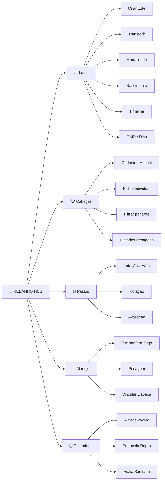
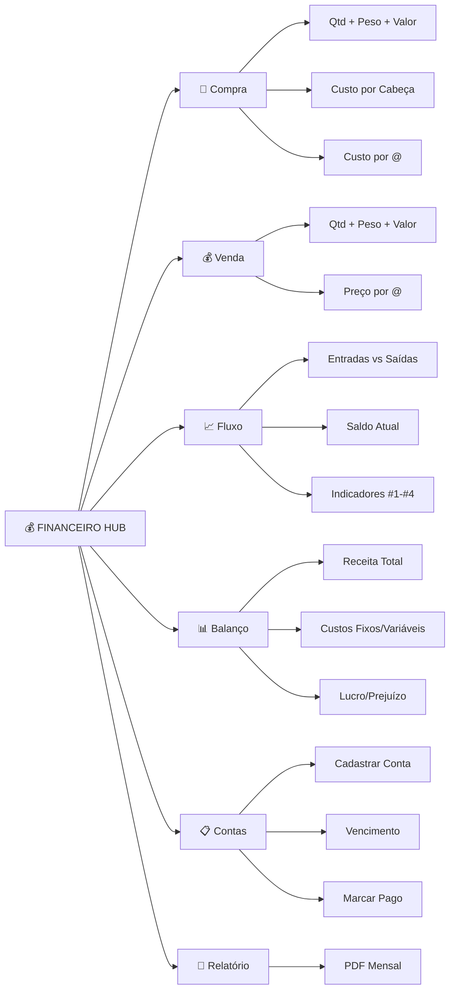
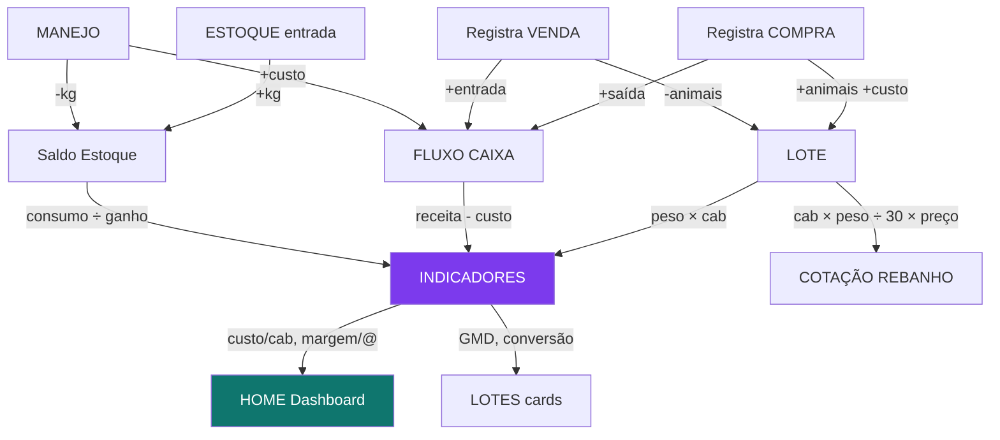

# AgroMacro — Plano Completo + Fluxogramas

---

## Fluxo Geral de Navegação

```mermaid
graph TD
    BAR["BARRA INFERIOR"]
    BAR --> HOME["🏠 Home<br/>Dashboard"]
    BAR --> REB["🐄 Rebanho<br/>Hub"]
    BAR --> FIN["💰 Financeiro<br/>Hub"]
    BAR --> OPS["📦 Operações<br/>Hub"]
    BAR --> CFG["⚙️ Config"]

    HOME --> H1["KPIs Principais"]
    HOME --> H2["Cotação Rebanho"]
    HOME --> H3["Alertas"]
    HOME --> H4["Gráficos"]
    HOME --> H5["Atalhos Rápidos"]

    REB --> R1["📋 Lotes"]
    REB --> R2["🐮 Cabeças"]
    REB --> R3["🌿 Pastos"]
    REB --> R4["💉 Manejo"]
    REB --> R5["🗓️ Calendário"]

    FIN --> F1["🐄 Compra"]
    FIN --> F2["💰 Venda"]
    FIN --> F3["📈 Fluxo"]
    FIN --> F4["📊 Balanço"]
    FIN --> F5["📋 Contas"]
    FIN --> F6["📑 Relatório"]

    OPS --> O1["📦 Estoque"]
    OPS --> O2["🔨 Obras"]
    OPS --> O3["👷 Funcionários"]

    CFG --> C1["Perfil Fazenda"]
    CFG --> C2["Preço @"]
    CFG --> C3["Backup"]
    CFG --> C4["Zerar Dados"]

    style HOME fill:#0F766E,color:#fff
    style REB fill:#EA580C,color:#fff
    style FIN fill:#2563EB,color:#fff
    style OPS fill:#D97706,color:#fff
    style CFG fill:#64748B,color:#fff
```

---

## Fluxo do Hub REBANHO

---

## Fluxo do Hub FINANCEIRO

---

## Fluxo de Dados

---

## Status: 21/26 ✅

| Grupo | Feitas | Faltam |
|---|:---:|:---:|
| Indicadores Financeiros #1-4 | 4/4 ✅ | — |
| Indicadores Produtivos #5-8 | 4/4 ✅ | — |
| Gestão Rebanho #9-12 | 4/4 ✅ | — |
| Gestão Pasto #13-15 | 3/3 ✅ | — |
| Manejo Avançado #16-18 | 3/3 ✅ | — |
| Financeiro Avançado #24-26 | 3/3 ✅ | — |
| **UX #19-23** | **0/5** | **PWA, PDF, Foto, Gráficos, Alertas** |

---

## Fases de Execução

| Fase | O que faz | Esforço |
|---|---|---|
| **1** | Reorganizar nav 5 abas + 3 hubs | 🔴 Grande |
| **2** | Módulo Cabeças individuais | 🟡 Médio |
| **3** | Gráficos, PDF, Fotos, Alertas | 🟡 Médio |
| **4** | PWA offline + Backup + Perfil | 🟢 Pequeno |
