# AgroMacro — Plano Completo + Fluxogramas

---

## Fluxo Geral de Navegação

```mermaid
graph TD
    BAR["BARRA INFERIOR"]
    BAR --> HOME["🏠 Home<br/>Dashboard"]
    BAR --> REB["🐄 Rebanho<br/>Hub"]
    BAR --> FIN["💰 Financeiro<br/>Hub"]
    BAR --> OPS["📦 Operações<br/>Hub"]
    BAR --> CFG["⚙️ Config"]

    HOME --> H1["KPIs Principais"]
    HOME --> H2["Cotação Rebanho"]
    HOME --> H3["Alertas"]
    HOME --> H4["Gráficos"]
    HOME --> H5["Atalhos Rápidos"]

    REB --> R1["📋 Lotes"]
    REB --> R2["🐮 Cabeças"]
    REB --> R3["🌿 Pastos"]
    REB --> R4["💉 Manejo"]
    REB --> R5["🗓️ Calendário"]

    FIN --> F1["🐄 Compra"]
    FIN --> F2["💰 Venda"]
    FIN --> F3["📈 Fluxo"]
    FIN --> F4["📊 Balanço"]
    FIN --> F5["📋 Contas"]
    FIN --> F6["📑 Relatório"]

    OPS --> O1["📦 Estoque"]
    OPS --> O2["🔨 Obras"]
    OPS --> O3["👷 Funcionários"]

    CFG --> C1["Perfil Fazenda"]
    CFG --> C2["Preço @"]
    CFG --> C3["Backup"]
    CFG --> C4["Zerar Dados"]

    style HOME fill:#0F766E,color:#fff
    style REB fill:#EA580C,color:#fff
    style FIN fill:#2563EB,color:#fff
    style OPS fill:#D97706,color:#fff
    style CFG fill:#64748B,color:#fff
```

---

## Fluxo do Hub REBANHO

```mermaid
graph LR
    HUB["🐄 REBANHO HUB"] --> LOTES["📋 Lotes"]
    HUB --> CAB["🐮 Cabeças"]
    HUB --> PAS["🌿 Pastos"]
    HUB --> MAN["💉 Manejo"]
    HUB --> CAL["🗓️ Calendário"]

    LOTES --> L1["Criar Lote"]
    LOTES --> L2["Transferir"]
    LOTES --> L3["Mortalidade"]
    LOTES --> L4["Nascimento"]
    LOTES --> L5["Timeline"]
    LOTES --> L6["GMD / Dias"]

    CAB --> CB1["Cadastrar Animal"]
    CAB --> CB2["Ficha Individual"]
    CAB --> CB3["Filtrar por Lote"]
    CAB --> CB4["Histórico Pesagens"]

    PAS --> P1["Lotação UA/ha"]
    PAS --> P2["Rotação"]
    PAS --> P3["Avaliação"]

    MAN --> M1["Vacina/Vermífugo"]
    MAN --> M2["Pesagem"]
    MAN --> M3["Vincular Cabeça"]

    CAL --> CL1["Alertas Vacina"]
    CAL --> CL2["Protocolo Repro"]
    CAL --> CL3["Ficha Sanitária"]
```

---

## Fluxo do Hub FINANCEIRO

```mermaid
graph LR
    HUB["💰 FINANCEIRO HUB"] --> COMP["🐄 Compra"]
    HUB --> VEND["💰 Venda"]
    HUB --> FLUX["📈 Fluxo"]
    HUB --> BAL["📊 Balanço"]
    HUB --> CONT["📋 Contas"]
    HUB --> REL["📑 Relatório"]

    COMP --> CO1["Qtd + Peso + Valor"]
    COMP --> CO2["Custo por Cabeça"]
    COMP --> CO3["Custo por @"]

    VEND --> V1["Qtd + Peso + Valor"]
    VEND --> V2["Preço por @"]

    FLUX --> FL1["Entradas vs Saídas"]
    FLUX --> FL2["Saldo Atual"]
    FLUX --> FL3["Indicadores #1-#4"]

    BAL --> B1["Receita Total"]
    BAL --> B2["Custos Fixos/Variáveis"]
    BAL --> B3["Lucro/Prejuízo"]

    CONT --> CT1["Cadastrar Conta"]
    CONT --> CT2["Vencimento"]
    CONT --> CT3["Marcar Pago"]

    REL --> RL1["PDF Mensal"]
```

---

## Fluxo de Dados

```mermaid
graph TB
    COMPRA["Registra COMPRA"] --> |"+animais +custo"| LOTE["LOTE"]
    COMPRA --> |"+saída"| FLUXO["FLUXO CAIXA"]

    VENDA["Registra VENDA"] --> |"-animais"| LOTE
    VENDA --> |"+entrada"| FLUXO

    ESTOQUE["ESTOQUE entrada"] --> |"+kg"| SALDO["Saldo Estoque"]
    MANEJO["MANEJO"] --> |"-kg"| SALDO
    MANEJO --> |"+custo"| FLUXO

    LOTE --> |"peso × cab"| KPI["INDICADORES"]
    FLUXO --> |"receita - custo"| KPI
    SALDO --> |"consumo ÷ ganho"| KPI

    KPI --> |"custo/cab, margem/@"| HOME["HOME Dashboard"]
    KPI --> |"GMD, conversão"| LOTES["LOTES cards"]

    LOTE --> |"cab × peso ÷ 30 × preço"| COTACAO["COTAÇÃO REBANHO"]

    style HOME fill:#0F766E,color:#fff
    style KPI fill:#7C3AED,color:#fff
```

---

## Status: 21/26 ✅

| Grupo | Feitas | Faltam |
|---|:---:|:---:|
| Indicadores Financeiros #1-4 | 4/4 ✅ | — |
| Indicadores Produtivos #5-8 | 4/4 ✅ | — |
| Gestão Rebanho #9-12 | 4/4 ✅ | — |
| Gestão Pasto #13-15 | 3/3 ✅ | — |
| Manejo Avançado #16-18 | 3/3 ✅ | — |
| Financeiro Avançado #24-26 | 3/3 ✅ | — |
| **UX #19-23** | **0/5** | **PWA, PDF, Foto, Gráficos, Alertas** |

---

## Fases de Execução

| Fase | O que faz | Esforço |
|---|---|---|
| **1** | Reorganizar nav 5 abas + 3 hubs | 🔴 Grande |
| **2** | Módulo Cabeças individuais | 🟡 Médio |
| **3** | Gráficos, PDF, Fotos, Alertas | 🟡 Médio |
| **4** | PWA offline + Backup + Perfil | 🟢 Pequeno |
