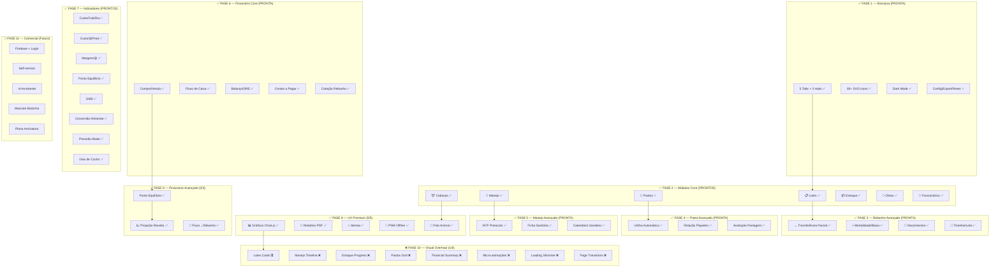

# 🐂 AgroMacro — Mapa de Progresso do Projeto

> **Referência permanente** — Consultar antes de cada implementação.
> Última atualização: 2026-02-12

---

## 📊 Visão Geral

```
PROGRESSO TOTAL: ████████████████████████████████████████████████████████████████████████████████░░░░░░░░░░ 40/50 (80%)

FUNCIONAL:       ████████████████████████████████████████████████ 38/38 (100%) ✅
VISUAL:          ██░░░░░░░░░░░░░░░░░░░░░░░░░░░░░░░░░░░░░░░░░░░░░░  1/8  (13%)
COMERCIAL:       ░░░░░░░░░░░░░░░░░░░░░░░░░░░░░░░░░░░░░░░░░░░░░░░░  0/5  (futuro)
```

---

## 🗺️ Fluxograma do Projeto



---

## ✅ Checklist por Sprint

### Sprint 1 — 📸 Foto (PRONTO ✅ já existia no código)
- [x] Input câmera/galeria no cadastro
- [x] Compressão Canvas 200px
- [x] Salvar Base64 no localStorage
- [x] Thumbnail na lista e ficha

### Sprint 2 — 💰 Financeiro Avançado (PRONTO ✅)
- [x] `calcProjecaoReceita()` — projeta ganho por GMD
- [x] Card de Projeção na Home + Fluxo
- [x] `getCustoPorLote()` breakdown nutrição/manejo/compra
- [x] Custo por Lote renderizado no Fluxo

### Sprint 3 — 🎨 Visual (Lotes + Manejo + Estoque)
- [ ] Cards premium com gradientes nos Lotes
- [ ] Timeline cards no Manejo
- [ ] Progress bars no Estoque

### Sprint 4 — 🎨 Visual (Pastos + Financeiro + Animações)
- [ ] Grid visual nos Pastos
- [ ] Summary cards no Financeiro
- [ ] Micro-animações + shimmer + transitions

### Sprint 5 — 🐄 Melhorias Pesquisa
- [ ] Campo touro/mãe nos nascimentos
- [ ] GTA na transferência
- [ ] Altura capim entrada/saída
- [ ] Template IATF novilhas

---

## 📋 Arquivos do Projeto

| Arquivo | Linhas | Função |
|---------|:------:|--------|
| `app.js` | 432 | Controller principal, nav, KPIs |
| `index.html` | ~1200 | Todas as views HTML |
| `styles.css` | ~900 | Estilos dark mode |
| `js/lotes.js` | 780 | CRUD de lotes |
| `js/cabecas.js` | 350 | Animais individuais |
| `js/financeiro.js` | 449 | Compra/Venda/Fluxo/Balanço |
| `js/calendario.js` | 608 | IATF + Sanitário + Carência |
| `js/indicadores.js` | 369 | 8 KPIs financeiros/produtivos |
| `js/estoque.js` | 560 | Insumos + Nutrição |
| `js/rebanho-ops.js` | 300 | Transfer/Mortalidade/Nascimento |
| `js/pastos.js` | 210 | CRUD pastos |
| `js/pasto-mgmt.js` | 200 | UA/ha + Rotação |
| `js/graficos.js` | 312 | 4 gráficos Chart.js |
| `js/relatorio.js` | 163 | PDF via window.print |
| `js/contas.js` | 270 | Contas a Pagar + Cotação |
| `sw.js` | 104 | Service Worker PWA |
| `manifest.json` | 29 | PWA Manifest |
| `seed-data.js` | ~700 | Dados de demonstração |

---

> 🎯 **OBJETIVO FINAL**: App 100% offline, mobile-first, premium, que compete com JetBov e iRancho mas sem mensalidade.
